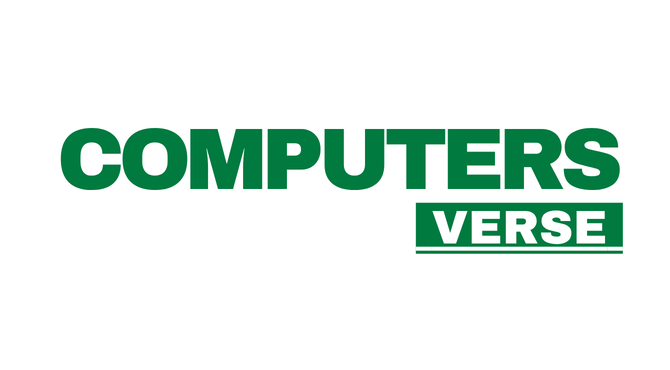

# 🖥️ عالم الحواسيب — ComputersVerse

<p align="center">
  
</p>

<p align="center">
  <strong>منصة تعليمية عربية حرة ومفتوحة المصدر لتعلّم أساسيات الحاسوب والتقنيات الرقمية.</strong>
</p>

<p align="center">
  <a href="#-حول-المشروع">حول المشروع</a> •
  <a href="#-المحتوى">المحتوى</a> •
  <a href="#-الهدف">الهدف</a> •
  <a href="#-المساهمة">المساهمة</a> •
  <a href="#-الترخيص">الترخيص</a>
</p>

---

## 🖥️ حول المشروع

**عالم الحواسيب — ComputersVerse** هو مشروع تعليمي عربي **حر ومفتوح المصدر** يهدف إلى تقديم المعرفة الأساسية حول الحاسوب والتقنيات الرقمية بطريقة **بسيطة، منظمة، ومناسبة للمبتدئين**.

الحاسوب هو أحد أهم الاختراعات التي غيّرت طريقة عملنا وتعلّمنا وتواصلنا. فمن خلاله يمكننا معالجة المعلومات، إنشاء المحتوى، استخدام التطبيقات، الوصول إلى الإنترنت، والتعامل مع مجموعة واسعة من الأدوات والتقنيات الرقمية.

بدأ تطور الحواسيب من أجهزة ضخمة وبسيطة مخصصة للحسابات، إلى أجهزة قوية وسريعة أصبحت جزءًا أساسيًا من حياتنا اليومية. ومع مرور الوقت ظهرت الحواسيب الشخصية، والهواتف الذكية، والخوادم، والأجهزة المتصلة بالإنترنت، لتشكّل معًا العالم الرقمي الحديث.

> 💡 **فهم أساسيات الحاسوب لا يتطلب أن تكون مبرمجًا أو خبيرًا في التقنية.**

معرفة مكونات الحاسوب، وأنظمة التشغيل، وإدارة الملفات، واستخدام لوحة المفاتيح والفأرة، وفهم الإنترنت والأدوات الرقمية تمنحك أساسًا قويًا للتعامل مع التكنولوجيا بثقة.

---

## 🎯 الهدف

يهدف **ComputersVerse** إلى إنشاء مصدر عربي مفتوح يساعد على:

* 📚 تبسيط المفاهيم التقنية للمبتدئين.
* 🧠 بناء فهم قوي لأساسيات الحاسوب.
* 🌐 فهم الإنترنت والعالم الرقمي.
* 🛠️ التعرف على الأدوات والتقنيات الحديثة.
* 🔐 نشر الوعي حول الأمان والحماية الرقمية.
* 🇦🇪 دعم المحتوى التقني باللغة العربية.
* 🤝 تشجيع المجتمع على المساهمة في نشر المعرفة.

---

## 📘 المحتوى

يأخذك المشروع في رحلة تعليمية تبدأ من أساسيات الحاسوب وصولًا إلى فهم الإنترنت والأدوات الرقمية.

### 🖥️ أساسيات الحاسوب

* ما هو الحاسوب؟
* كيف يعمل الحاسوب؟
* مكونات الحاسوب الأساسية.
* المعالج CPU.
* الذاكرة RAM.
* وحدات التخزين.
* اللوحة الأم.
* أجهزة الإدخال والإخراج.

### ⌨️ لوحة المفاتيح والفأرة

* التعرف على لوحة المفاتيح.
* أهم المفاتيح ووظائفها.
* اختصارات لوحة المفاتيح.
* استخدام الفأرة.
* الأجهزة الطرفية.

### 📁 الملفات والمجلدات

* ما هو الملف؟
* ما هو المجلد؟
* إنشاء الملفات والمجلدات.
* نسخ ونقل وحذف الملفات.
* تنظيم البيانات.
* امتدادات الملفات.

### ⚙️ أنظمة التشغيل والبرامج

* ما هو نظام التشغيل؟
* الفرق بين نظام التشغيل والبرنامج.
* التطبيقات والبرامج.
* تثبيت وإزالة البرامج.
* تحديث النظام والبرامج.

### 🌐 الإنترنت

* ما هو الإنترنت؟
* كيف يعمل الإنترنت؟
* المتصفحات.
* مواقع الويب.
* عناوين IP.
* DNS.
* الخوادم.
* أساسيات الشبكات.

### 🔐 الأمان والحماية الرقمية

* كلمات المرور الآمنة.
* المصادقة متعددة العوامل.
* التصيد الإلكتروني.
* البرمجيات الخبيثة.
* حماية الحسابات والبيانات.
* الممارسات الآمنة على الإنترنت.

### 🛠️ الأدوات والتقنيات الرقمية

* أدوات الإنتاجية.
* التخزين السحابي.
* أدوات التواصل.
* أدوات البحث.
* الخدمات الرقمية.
* التقنيات الحديثة.

### 💡 نصائح للمبتدئين

مجموعة من النصائح والممارسات العملية التي تساعدك على استخدام الحاسوب والتكنولوجيا بشكل أفضل وأكثر أمانًا.

---

## 🗺️ رحلة التعلّم

```text
🖥️ أساسيات الحاسوب
        ↓
🧩 مكونات الحاسوب
        ↓
⌨️ لوحة المفاتيح والفأرة
        ↓
📁 الملفات والمجلدات
        ↓
⚙️ أنظمة التشغيل والبرامج
        ↓
🌐 الإنترنت والشبكات
        ↓
🔐 الأمان الرقمي
        ↓
🛠️ الأدوات والتقنيات الرقمية
```

---

## ✨ لماذا ComputersVerse؟

| الميزة                  | الوصف                                     |
| ----------------------- | ----------------------------------------- |
| 🇦🇪 **باللغة العربية** | محتوى تقني مبسّط باللغة العربية           |
| 🎓 **للمبتدئين**        | لا تحتاج إلى خبرة تقنية مسبقة             |
| 🧩 **منظم**             | التعلم من الأساسيات إلى المفاهيم المتقدمة |
| 🌐 **مفتوح المصدر**     | يمكن للجميع المساهمة في تطويره            |
| 🆓 **حر**               | المعرفة متاحة للجميع                      |
| 🤝 **مجتمعي**           | يساهم المجتمع في تحسين المحتوى            |

---

## 🚀 ابدأ رحلة التعلم

إذا كنت جديدًا على عالم الحواسيب، ابدأ من **أساسيات الحاسوب** وتابع الدروس بالترتيب.

> 🔍 **تعلّم الأساسيات اليوم، وابنِ مهاراتك الرقمية غدًا.**

---

## 🤝 المساهمة

ComputersVerse مشروع مفتوح المصدر، ونرحب بكل من يرغب في المساهمة في تطوير المحتوى العربي.

يمكنك المساهمة من خلال:

* 📝 تحسين المحتوى التعليمي.
* 🐛 الإبلاغ عن الأخطاء.
* 💡 اقتراح مواضيع جديدة.
* 🌐 تحسين الترجمة واللغة.
* 🎨 تحسين واجهة المشروع.
* 💻 المساهمة في تطوير الكود.
* 📚 إضافة مصادر تعليمية مفيدة.

### طريقة المساهمة

```bash
# استنساخ المشروع
git clone https://github.com/openarabtech/ComputersVerse.git

# الانتقال إلى مجلد المشروع
cd ComputersVerse

# إنشاء فرع جديد
git checkout -b feature/my-contribution

# بعد إجراء التعديلات
git add .

git commit -m "Add: my contribution"

git push origin feature/my-contribution
```

ثم يمكنك إنشاء **Pull Request** للمشروع.

---

## 📜 الترخيص

هذا المشروع مرخّص بموجب **رخصة MIT**.

تسمح الرخصة باستخدام المشروع وتعديله ونسخه وتوزيعه بحرية، وفق شروط رخصة MIT.

---

## 🌍 المجتمع

ComputersVerse جزء من جهود نشر المعرفة التقنية باللغة العربية ودعم المشاريع العربية مفتوحة المصدر.

مدعوم من منظمة:

**[Open Arab Tech — التقنية العربية المفتوحة](https://www.linkedin.com/company/openarabtech/)**

---

## 📌 معلومات المشروع

|                   |                |
| ----------------- | -------------- |
| **اسم المشروع**   | ComputersVerse |
| **الاسم العربي**  | عالم الحواسيب  |
| **اللغة**         | العربية 🇦🇪   |
| **النوع**         | منصة تعليمية   |
| **المصدر**        | مفتوح المصدر   |
| **الترخيص**       | MIT            |
| **الجهة الداعمة** | Open Arab Tech |

---

## ⭐ ساهم في نشر المعرفة

إذا وجدت المشروع مفيدًا، يمكنك دعمه من خلال:

⭐ وضع **Star** للمستودع
🐛 الإبلاغ عن الأخطاء
💡 اقتراح تحسينات
🤝 المساهمة في المحتوى والكود
📢 مشاركة المشروع مع الآخرين

كل مساهمة، مهما كانت صغيرة، تساعد في بناء **محتوى تقني عربي أفضل**.

---

<p align="center">

**🖥️ ComputersVerse**

**تعلّم • اكتشف • طوّر**

© 2026 ComputersVerse

</p>
